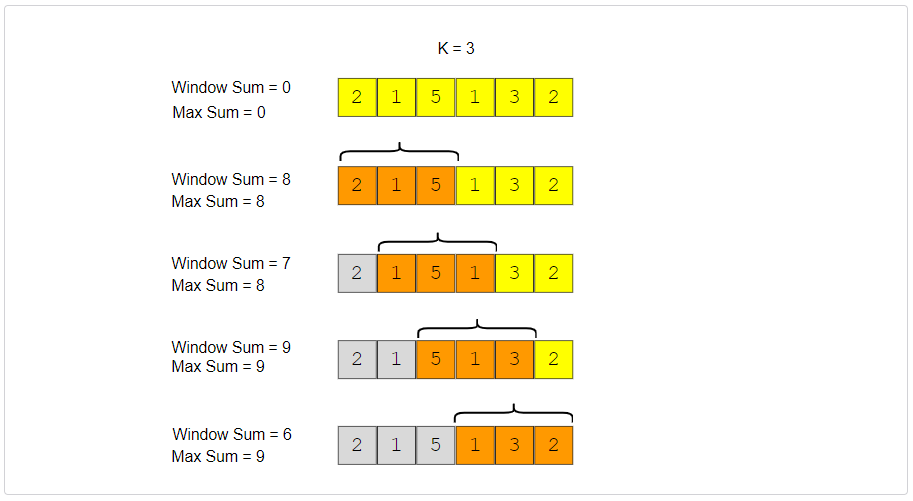
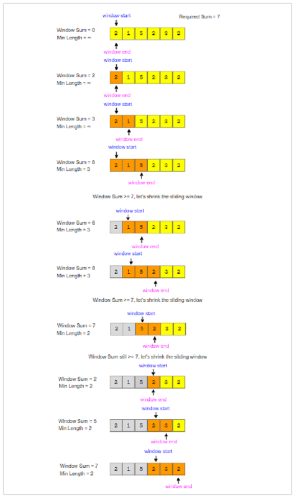

## Sliding Window

### Maximum Sum Subarray of Size K  
**Problem Statement**   
Given an array of positive numbers and a positive number ‘k’, find the **maximum sum of 
any contiguous subarray of size ‘k’**.  

  

### Smallest Subarray with a given Sum
**Problem Statement**  
Given an array of positive numbers and a positive number ‘S’, find the length of the 
**smallest contiguous subarray whose sum is greater than or equal to ‘S’**.  
Return 0, if no such subarray exists.  

  

### Longest Substring with K Distinct Characters  
**Problem Statement**
Given a string, find the length of the **longest substring in it with no more than K distinct characters**.